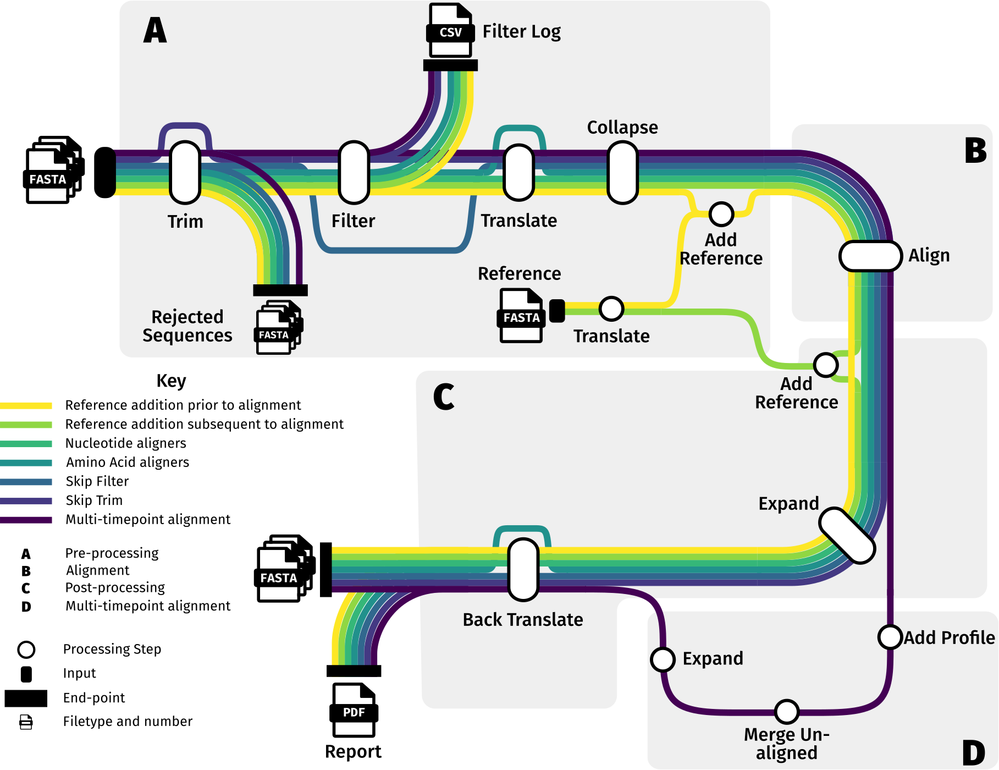
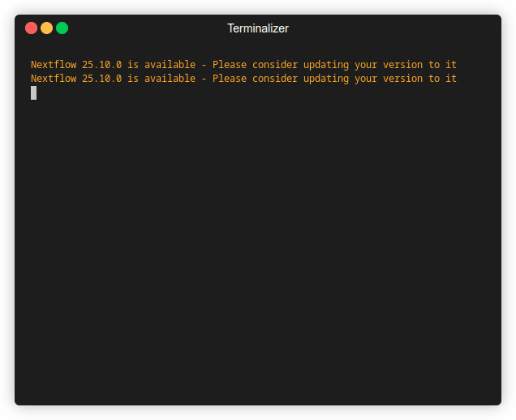

# DeepLEAP

DeepLEAP is a [Nextflow](https://github.com/nextflow-io/nextflow) pipeline that trims, filters and aligns long-read nucleotide sequences. Although specifically designed for HIV-1, it can be configured to work with data from other organisms.



## Usage

### Requirements

DeepLEAP is composed of a core Nextflow pipeline that depends on various third-party tools packaged in Docker containers. To run the pipeline, you must have [Nextflow v25.04.2](https://nextflow.io/docs/latest/) installed on your system, as well as [Docker](https://docs.docker.com/) or [Singularity](https://sylabs.io/docs/).

### Installation

To get started, clone this repository into the directory of your choice:

```bash
git clone git@github.com:HIVDiversity/deepleap.git
```

Then, navigate to the `deepleap` directory, and you're ready to run the pipeline.

### Running the Pipeline
To run the DeepLEAP pipeline, use the following command as a template. Make sure to replace the placeholder path `${deepleap_root}` with the path to the directory you cloned this repo to.

```bash
nextflow run -c nextflow.config main.nf \
--run_name testA \
--samplesheet ${deepleap_root}/sample_data/samplesheet.csv  \ 
--reference_file ${deepleap_root}/sample_data/hxb2_env.fasta \
--aligner MAFFT \
-profile test,docker \
--region_of_interest envelope-polyprotein \
--sample_base_dir ${deepleap_root}/sample_data/input \
-output-dir ./testoutput/ \
--skip_trim
```



> [!NOTE]
> Depending on your docker setup, you may need to enter your sudo password. The prompt for this sometimes gets hidden by the rest of the Nextflow output, so be sure to check your terminal if the pipeline seems to hang. 


#### Pipeline Options
- `--run_name`: A name for this pipeline run. Is used in logging and report generation.
- `--samplesheet`: Path to a CSV file containing sample information. See `sample_data/samplesheet.csv` for an example.
- `--reference_file`: Path to a FASTA file containing the reference sequence for alignment.
- `--aligner`: The alignment tool to use.
- `--region_of_interest`: The genomic region to focus on. This does not have to be in any format, and is largely present for legacy reasons.
- `--sample_base_dir`: Path to the directory containing input FASTA files. This is the directory where the files specified in the samplesheet are will be looked for. 

- `--skip_trim`: Optional flag to skip the trimming step. In this case it is necessary since the input files are already trimmed to the region of interest.

#### Nextflow Options
- `-profile`: Specifies the configuration profile to use. In this example, we use the `test` profile for testing purposes which will cap the memory usage to the maximum available on the machine and the `docker` profile to run the pipeline using Docker containers. You can also use the `singularity` profile if you prefer Singularity.
- `-c`: Specifies the path to the Nextflow configuration file. By default, Nextflow looks for a file named `nextflow.config` in the current directory, but the option is specified here for clarity.
- `-output-dir`: Path to the directory where output files will be saved.

#### Outputs
The outputs of the pipeline will be saved in the directory specified by the `-output-dir` option. The structure of the output directory will be as follows:

```
testoutput/
├── amino_acid_alignments/
├── execution_report/
├── functional_filter
├── logs/
├── nucleotide_alignments/
├── rejected_sequences/
└── trimmed_sequences/
```
