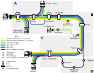

---
hide:
  - navigation
  - toc
---

<h1 style="margin: 0em">DeepLEAP</h1>

Deep-sequence Long-read Envelope Alignment Pipeline

---

DeepLEAP is a Nextflow pipeline designed to perform codon-aware alignments of long-read sequencing data. Although initially designed for HIV envelope sequences, it can be adapted for other coding sequences.
<figure markdown="1">

<figcaption>Execution diagram of the DeepLEAP pipeline.</figcaption>
</figure>