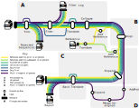

# Overview
 
**DeepLEAP** (Deep-sequence Long-read Envelope Alignment Pipeline) is a [Nextflow](https://www.nextflow.io/)
pipeline for codon-aware multiple sequence alignment of long-read sequencing data. We developed
it at the [HIV Diversity Laboratory](https://github.com/HIVDiversity) at the University of Cape
Town primarily for our own internal use, and have made it public in the spirit of open and
reproducible science.
 
## Background
 
HIV envelope sequences present a particular challenge for alignment pipelines. The envelope gene
contains overlapping reading frames (regions that can be in-frame or out-of-frame depending on
context) meaning that aligners tend to introduce or misplace gaps
in a way that breaks the codon structure of the sequence. Once codon structure is broken,
downstream analyses (phylogenetics, selection pressure, protein structure prediction) become
unreliable.
 
DeepLEAP handles this through three steps:
 
1. **Trim** — extract the coding region of interest from quality-filtered reads, handling overlapping
   or complex reading frame structures
2. **Filter** — screen out "non-functional" sequences: those carrying early stop codons that
   would prevent the production of a viable viral protein
3. **Align** — produce a codon-aware multiple sequence alignment via "_backtranslation_" using your choice of aligner

Although DeepLEAP was built and validated around HIV envelope sequences, the pipeline is
general enough to be applied to other viral coding sequences. Users working outside of HIV
should treat it as experimental and validate outputs carefully.
 
## Pipeline Overview
 
<figure markdown="1">

<figcaption>Execution diagram of the DeepLEAP pipeline, showing the three main stages: preprocessing (trim), functional filtering, and alignment.</figcaption>
</figure>
### Stage 1 — Preprocessing (Trim)
 
Input sequences are quality-filtered reads provided as FASTA files (not raw FASTQ). They are
mapped to a reference sequence and trimmed to the region of interest. The
default and recommended method is **MINIMAP2**, which is fast and accurate for the majority of
use cases. An alternative method, **AGA**, is available for sequences with particularly complex
overlapping reading frame structures, but is slower and experimental — it should only be used
if you have a specific reason to do so.
 
!!! tip "Which preprocessing method should I use?"
    For most users and datasets, the answer is MINIMAP2. AGA is only worth considering if
    your sequences contain nested or overlapping ORFs that MINIMAP2 handles poorly. If you
    are unsure, start with MINIMAP2.
 
### Stage 2 — Functional Filtering
 
Before alignment, DeepLEAP screens sequences for functionality. In the context of viral
sequences, a "functional" sequence is one that could plausibly produce a protein capable of
contributing to a viable, infectious virus. The primary criterion is the absence of premature
stop codons: a stop codon early in the reading frame is a strong indicator that the sequence
is either defective, hypermutated, or an artifact of sequencing.
 
!!! note "A note on the filtering approach"
    This is a deliberately naive approach to functional filtering — it does not model protein
    folding, receptor binding, or other biological criteria. For our purposes (HIV envelope
    sequences from clinical samples) early stop codon screening is a reliable and sufficient
    proxy for functionality. If you are applying DeepLEAP to a different system, consider
    whether this criterion is appropriate for your data.
 
Sequences that fail the functional filter are not discarded — they are written to a separate
`rejected_sequences` output directory so they can be inspected.
 
!!! note "Skipping the functional filter"
    The filter can be disabled with `--skip_functional_filter`. This may be appropriate if
    you are working with defective sequences intentionally, or if you want to align all
    sequences and filter downstream.
 
### Stage 3 — Alignment
 
The filtered sequences are aligned using the aligner of your choice. DeepLEAP supports
a wide range of aligners:
 
| Aligner | Notes |
|---|---|
| **MAFFT** *(default)* | Fast and accurate; recommended for most datasets |
| MAFFT-SEED | MAFFT with a seed alignment; useful for very large datasets |
| MUSCLE | Good general-purpose aligner |
| PROBCONS | Probabilistic consistency-based; accurate but slower |
| T-Coffee | High accuracy; slower on large datasets |
| T-Coffee Regressive | Scalable T-Coffee variant for large datasets |
| PRANK | Phylogeny-aware; recommended when evolutionary distances are large |
| Clustal Omega | Fast; good for large numbers of sequences |
| ClustalW | Classic aligner; included for reproducibility with older workflows |
| VIRULIGN | Codon-aware aligner specifically designed for viral sequences |
| MACSE | Codon-aware aligner that handles frameshifts |
| ViralMSA | Reference-guided aligner optimised for viral genomes |
| PAGAN | Phylogeny-aware progressive aligner |
 
A dedicated guide to choosing an aligner for your dataset is available in the
[reference section](../reference/parameters.md).
 
## Key Features
 
- **Codon-aware alignment** — gaps are introduced at codon boundaries, preserving reading frame
  integrity for downstream analyses
- **Functional sequence filtering** — removes defective sequences before alignment, reducing
  noise in the final output
- **Flexible preprocessing** — MINIMAP2 for standard workflows; AGA for complex reading frames
- **Portable** — runs locally, on SLURM-based HPC clusters, or in cloud environments with no
  software to install beyond Nextflow and a container runtime
- **Containerised** — all tools run inside Docker, Singularity, or Apptainer containers;
  results are fully reproducible across systems
- **Scalable** — designed to handle large cohorts with many samples
## Prerequisites at a Glance
 
You need two things installed on your system before running DeepLEAP:
 
1. [Nextflow](https://www.nextflow.io/) ≥ 25.04.2 (requires Java)
2. A container runtime — one of [Docker](https://www.docker.com/),
   [Singularity](https://sylabs.io/docs/), or [Apptainer](https://apptainer.org/)
No other local software installation is required. All pipeline tools are packaged in containers.
 
## Using These Docs
 
These docs are written for two audiences. If you're not sure which path is right for you:
 
=== "I'm a lab user"
 
    You will probably interact with DeepLEAP through the **web frontend**. Head to the
    [Frontend Guide](user-guide/frontend.md) to get set up, or read the
    [Getting Started](user-guide/installation.md) page if you plan to run from the command line.
 
=== "I'm a bioinformatician"
 
    Start with [Installation](user-guide/installation.md) and [Running the CLI](user-guide/running-cli.md),
    then consult the [Parameter Reference](reference/parameters.md) for full configuration options.
    The [Developer Guide](developer-guide/architecture.md) covers the pipeline internals,
    how to add a site-specific compute profile, and how to contribute.
 
## Known Limitations
 
- **Validation scope** — DeepLEAP has been developed and tested primarily on HIV envelope
  sequences. Application to other organisms or gene regions is possible but should be treated
  as experimental; validate your outputs carefully.
- **Aligner upper bounds** — DeepLEAP does not modify the underlying aligners. The practical
  upper limit on dataset size is therefore determined by whichever aligner you choose.
- **Process-level tests** — formal per-module test coverage is not yet fully implemented.
  The `test` profile runs an end-to-end integration test using the sample dataset, but
  individual process unit tests are a work in progress.
## Source Code & Issues
 
DeepLEAP is open source. The source code is available on
[GitHub](https://github.com/HIVDiversity/deepleap). Bug reports and feature requests can be
submitted via the [issue tracker](https://github.com/HIVDiversity/deepleap/issues).
